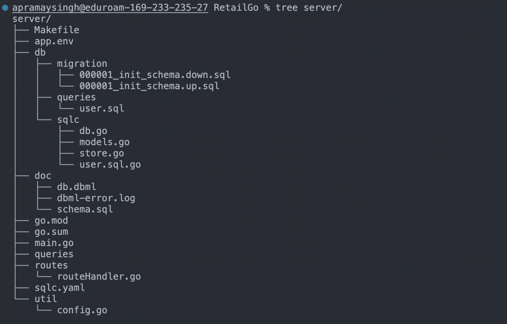
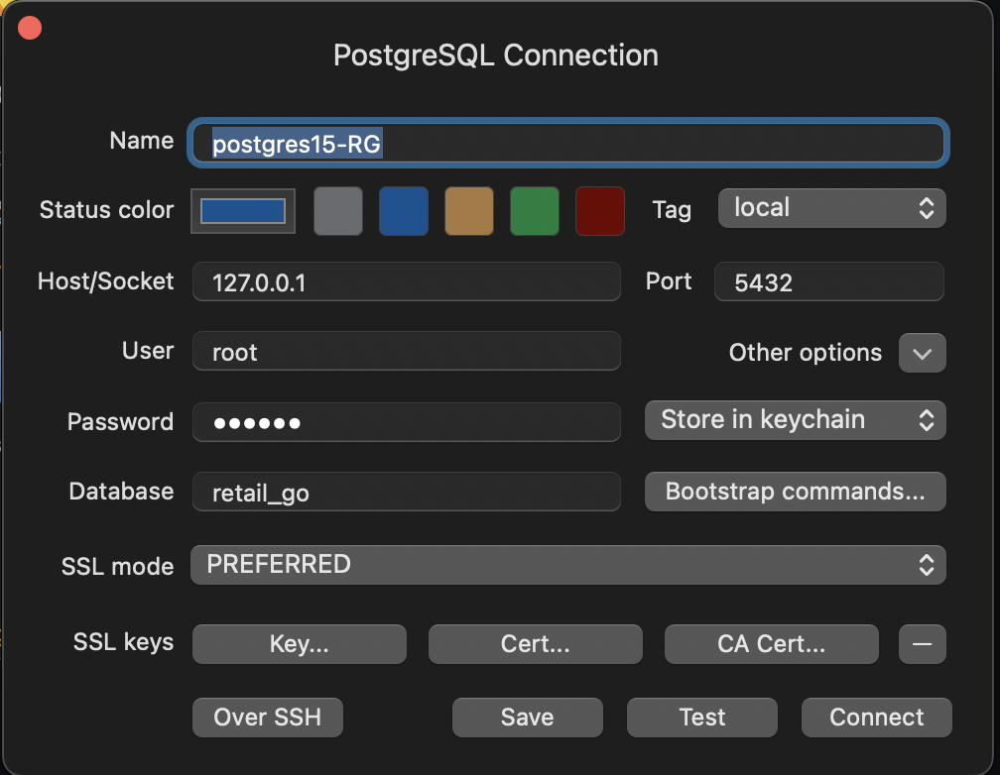

# RetailGo
RetailGo


Contributors: Colby Frey, Apramay Singh


### Getting Started with the Backend!

```console foo@bar:~$ git clone git@github.com:hktrib/RetailGo.git```



To lessen the install burden, we'll work with postgres on a docker container via PORT# 5432

1. Ensure that you have docker desktop installed. If not download it here https://www.docker.com/products/docker-desktop/
2. (Ignore Steps 2 if you want to use another GUI viewer)Download TablePlus at https://tableplus.com/


4. Once your project has been cloned navigate to the **server/Makefile** file.


5. Most of the commands are pretty self-explanatory. 
    - ```foo@bar:RetailGo/server$ make postgres``` spins up a docker container
    - ```foo@bar:RetailGo/server$ make createdb``` creates a database -> retail_go
    - ```foo@bar:RetailGo/server$ make drodb``` deletes a database -> retail_go
    - ```foo@bar:RetailGo/server$ make dbschema``` creates the schema.sql file fromt the db.dbml file
    - ```foo@bar:RetailGo/server$ make migrateup``` migrates the latest schema over to the database. 
    - ```foo@bar:RetailGo/server$ make migratedown``` migrates us back to our previous schema 
    - ```foo@bar:RetailGo/server$ make sqlc``` generates our sqlc database interfacing code (based on the queries in our queries in the various .sql files in the **queries** folder) and places them inside the **db/sqlc** folder.
    - ```console foo@bar:RetailGo/server$ make sqlc_delete``` deletes the **db/sqlc** folder.
6. run **make postgres** **make createdb** **make migrateup** and Configure TablePlus to connect to the retail_go database via PORT# 5432 (Password: secret)

7. Run ```console foo@bar:RetailGo/server$ go run main.go``` 

##### Working With DBML
Check the docs linked below to get familiar
Install the "DBML Live Preview" extension

##### Docs
Go-Chi -> https://go-chi.io/
DBMl -> https://dbml.dbdiagram.io/docs/
Sqlc -> https://docs.sqlc.dev/en/stable/tutorials/getting-started-postgresql.html
